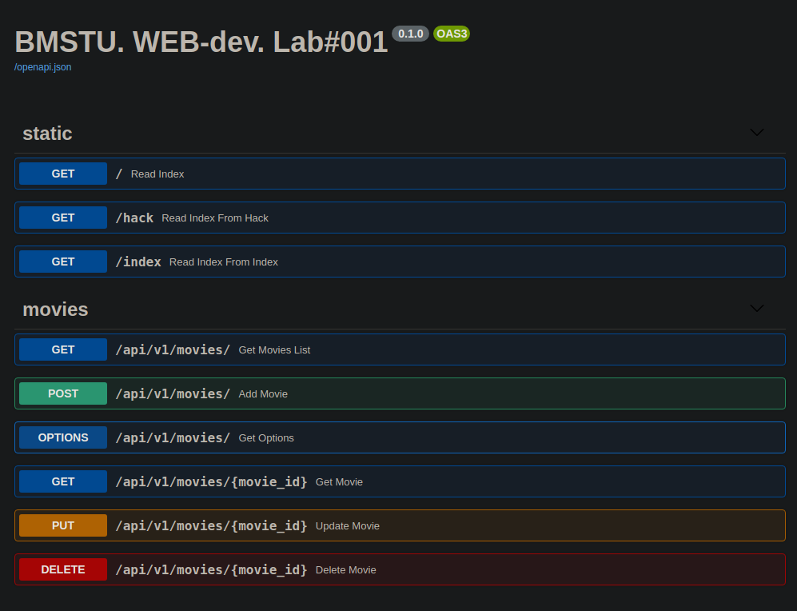

<p align="center">
  
</p>

### Министерство науки и высшего образования Российской Федерации

### Федеральное государственное бюджетное образовательное учреждение высшего образования

### «Московский государственный технический университет имени Н.Э. Баумана

### (национальный исследовательский университет)» (МГТУ им. Н.Э. Баумана)

ФАКУЛЬТЕТ Информатика и системы управления \
КАФЕДРА Программное обеспечение ЭВМ и информационные технологии \
ДИСЦИПЛИНА Основы WEB разработки

### ОТЧЁТ ПО ЛАБОРАТОРНОЙ РАБОТЕ № 1

### "Изучение протокола HTTP"

Выполнил:
студент группы ИУ7-68Б(В) \
Косаревский Д.П. \
Преподаватель: Бекасов Д. Е. \
Москва, 2021 г.

#### Цель работы:

    • ознакомиться с базовым протоколом web – протоколом HTTP
    • произвести отправку запросов на несколько известных интернет-сервисов
    • реализовать серверное приложение с использованием фреймворка
    • добавить в приложение статику и маршрутизацию

1. Базовая часть работы

   1.1. Цель данной работы – ознакомится с применением протокола HTTP на практике, в реальных системах. Каждый из
   рассмотренных типов запросов предлагается отправить на несколько известных интернет-сервисов. Впрочем, сервисы
   указаны лишь как примеры и при желании вы можете выбрать другие (социальные сети, почта, облака, новостные сайты и
   т.д.).  
   1.2. С помощью специального ПО (Postman, либо многочисленные аналоги, например, Restlet Clent - расширение для
   Chrome) вручную отправить следующие запросы и ответить на предлагаемые вопросы.

   1.2.1. Запрос OPTIONS. Отправьте запрос на http://mail.ru, http://ya.ru, www.rambler.ru, https://www.google.ru
   , https://github.com/, www.apple.com/. Для чего используется запрос OPTIONS? Какие коды ответов приходят при этом
   запросе? Какие сайты правильно обработали запрос и вернули ожидаемые данные?

> Запрос OPTIONS используется для определения возможностей веб-сервера или параметров соединения для конкретного ресурса.

> http://mail.ru - 200 [OK, вернул 19 Headers без информации о разрешённых методах]

> http://ya.ru - 403 [Forbidden, вернул 6 Headers без информации о разрешённых методах, 2 Cookies, в Body есть текст ошибки: "Произошла ошибка на сервере Мы знаем о проблеме и работаем над её решением. Попробуйте обновить страницу через некоторое время."]

> www.rambler.ru - 200 [OK, вернул 15 Headers без информации о разрешённых методах, 2 Cookies]

> https://www.google.ru - 405 [Method Not Allowed, вернул 8 Headers, в котором есть информация о разрешённых методах: Allow - GET, HEAD]

> https://github.com/ - 404 [Not Found, вернул 13 Headers, но не нашёл страницу, т.к. нужно ходить на http]

> www.apple.com/ - 200 [OK, вернул 14 Headers без информации о разрешённых методах, 1 Cookies]

1.2.2. Запрос HEAD. vk.com, www.apple.com, www.msn.com. Для чего нужен запрос HEAD? Какой сайт прислал ожидаемый ответ?

> Аналогичен методу GET, за исключением того, что в ответе сервера отсутствует тело. Запрос HEAD обычно применяется для извлечения метаданных, проверки наличия ресурса (валидация URL) и чтобы узнать, не изменился ли он с момента последнего обращения.

> vk.com - 418 [I'm a teapot (RFC 2324), вернул 6 Headers без информации о разрешённых методах] =)

> www.apple.com - 200 [OK, вернул 15 Headers без информации о разрешённых методах, 1 Cookies]

> www.msn.com - 200 [OK, вернул 28 Headers c информацией о разрешённых методах: Access-Control-Allow-Methods - HEAD,GET,OPTIONS, 4 Cookies]

1.2.3. Запросы GET и POST. Отправьте по запросу на yandex.ru, google.com и apple.com. Что они вернули? Что содержится в
теле ответа?

> GET yandex.ru - 200 [OK, вернул 19 Headers без информации о разрешённых методах, 6 Cookies, в Body - HTML и JS]

> POST yandex.ru - 403 [Forbidden, вернул 8 Headers без информации о разрешённых методах, 6 Cookies, в Body есть текст ошибки: "Произошла ошибка на сервере Мы знаем о проблеме и работаем над её решением. Попробуйте обновить страницу через некоторое время.", в Body - HTML и JS]

> GET google.com - 200 [OK, вернул 12 Headers без информации о разрешённых методах, 1 Cookies, в Body - HTML и JS]

> POST google.com - 405 [Method Not Allowed, вернул 7 Headers, в котором есть информация о разрешённых методах: Allow - GET, HEAD, в Body - HTML и JS]

> GET www.apple.com - 200 [OK, вернул 14 Headers без информации о разрешённых методах, 1 Cookies, в Body - HTML и JS]

> POST www.apple.com - 200 [OK, вернул 14 Headers без информации о разрешённых методах, 1 Cookies, в Body - HTML и JS]

1.3. Работа с api сайта. Многие крупные сервисы предоставляют открытое api. Как правило, оно реализовано на подходе
REST, но это необязательно. Такое api используется сторонними сервисами и приложениями, которые хотят воспользоваться
услугами предоставляющего такое api сервиса. Рассмотрим такое api на примере сайта vk.com (при желании можно выбрать
другой подходящий сервис).

1.3.1. Зайдите на https://vk.com/dev/api_requests и посмотрите структуру запросов к данному api.

1.3.2. Используя документацию (https://vk.com/dev/methods) выполните следующие задания (обратите внимание, запросы нужно
отправлять не из предложенной на сайте формы, а как в предыдущем задании):

1.3.2.1. Получите список всех факультетов МГТУ им. Н.Э.Баумана.

> Список факультетов получен через с Postman с помощью следующего запроса:
```https://api.vk.com/method/groups.getById?access_token={{token}}&v=5.130&group_id=bmstu1830&w=page-40427933_43931670```

> Параметры:
> * `access_token` - токен для работы с API
> * `v` - версия API Вконтакте
> * `group_id` - идентификатор группы нашего университета
> * `w` - страница группы, на которой размещена информация о факультетах

> Однако такой ответ получен не в JSON формате
> для получения ответа в JSON формате можно использовать метод `database.getUniversities`
```https://api.vk.com/method/database.getUniversities?q=МГТУ%20им%20Баумана&country_id=1&city_id=1&access_token={{token}}&v=5.130```

> Параметры:
> * `access_token` - токен для работы с API
> * `v` - версия API Вконтакте
> * `q` - поисковый запрос
> * `country_id` - идентификатор страны - Россия
> * `city_id` - идентификатор города - Москва

> Исполнив запрос мы получаем идентификаторы нашего университета и отдельно идентификатор ИСОТ (второе высшее)

```json
{
  "response": {
    "count": 2,
    "items": [
      {
        "id": 250,
        "title": "МГТУ им. Н. Э. Баумана"
      },
      {
        "id": 169759,
        "title": "ИСОТ МГТУ им. Н. Э. Баумана (бывш. МИПК МГТУ им. Н. Э. Баумана)"
      }
    ]
  }
}
```

> Используем метод `database.getFaculties` и основной идентификатор университета - 250
```https://api.vk.com/method/database.getFaculties?university_id=250&access_token={{token}}&v=5.130```

> Параметры:
> * `access_token` - токен для работы с API
> * `v` - версия API Вконтакте
> * `university_id` - идентификатор нашего университета

> Полученный ответ:

```json
{
  "response": {
    "count": 20,
    "items": [
      {
        "id": 1031,
        "title": "Аэрокосмический факультет"
      },
      {
        "id": 1032,
        "title": "Факультет инженерного бизнеса и менеджмента"
      },
      {
        "id": 1033,
        "title": "Факультет информатики и систем управления"
      },
      {
        "id": 1034,
        "title": "Факультет машиностроительных технологий"
      },
      {
        "id": 1035,
        "title": "Факультет оптико-электронного приборостроения"
      },
      {
        "id": 1036,
        "title": "Приборостроительный факультет"
      },
      {
        "id": 1037,
        "title": "Радиотехнический факультет"
      },
      {
        "id": 1038,
        "title": "Факультет радиоэлектроники и лазерной техники"
      },
      {
        "id": 1039,
        "title": "Факультет ракетно-космической техники"
      },
      {
        "id": 1040,
        "title": "Факультет робототехники и комплексной автоматизации"
      },
      {
        "id": 1041,
        "title": "Факультет специального машиностроения"
      },
      {
        "id": 1042,
        "title": "Факультет фундаментальных наук"
      },
      {
        "id": 1043,
        "title": "Факультет энергомашиностроения"
      },
      {
        "id": 1044,
        "title": "Кафедра юриспруденции, интеллектуальной собственности и судебной экспертизы"
      },
      {
        "id": 1803,
        "title": "Факультет биомедицинской техники"
      },
      {
        "id": 1804,
        "title": "Факультет социально-гуманитарных наук"
      },
      {
        "id": 56430,
        "title": "Факультет лингвистики"
      },
      {
        "id": 56431,
        "title": "Физкультурно-оздоровительный факультет"
      },
      {
        "id": 2071503,
        "title": "Головной учебно-исследовательский и методический центр (ГУИМЦ)"
      },
      {
        "id": 2183736,
        "title": "Факультет военного обучения (Военный институт)"
      }
    ]
  }
}
```

> На втором высшем образовании факультеты найти не удалось =), ответ по идентификатору ИСОТ-а:

```json
{
  "response": {
    "count": 0,
    "items": []
  }
}
```

1.3.2.2. Получите свою аватарку.

> Используем метод `users.get`
```https://api.vk.com/method/users.get?fields=photo_max_orig&access_token={{token}}}}&v=5.130```

> Параметры:
> * `access_token` - токен для работы с API
> * `v` - версия API Вконтакте
> * `fields` - список полей, которые необходимо вернуть

> Ответ API

```json
{
  "response": [
    {
      "first_name": "If",
      "id": 643267794,
      "last_name": "If",
      "can_access_closed": true,
      "is_closed": false,
      "photo_max_orig": "https://sun1-86.userapi.com/s/v1/ig2/89jDcnXHscHv-IAhcrWxjyZ8W-yc8uGEKKd485qORJY-aNnSuqwuHSrerV08SMFZWo2lZ2pGflKXfC4ngHl9o6DV.jpg?size=400x0&quality=96&crop=27,27,661,786&ava=1"
    }
  ]
}
```

> В ответе содержится гиперссылка на аватарку в параметре `photo_max_orig`

1.3.2.3. Ответьте на вопросы: какой код ответа присылается от api? Что содержит тело ответа? В каком формате и какой
кодировке содержаться данные? Какой веб-сервер отвечает на запросы? Какая версия протокола HTTP используется?

> Во всех случаях API Вконтакте отдавал код - `200`

> Тело ответа содержит запрашиваемую нами информацию.

> Во всех случаях содержит `JSON` в кодировке `utf-8` (не считая случая просмотра факультетов на странице группы МГТУ, там мы получили `HTML`)

> На запросы отвечал веб-сервер `kittenx`

> По умолчанию в Postman используется протокол `HTTP/1.1` и изменять этот параметр нельзя, но открытый [запрос](https://github.com/postmanlabs/postman-app-support/issues/6242) в адрес разработчиков может изменить ситуацию в будущем.

1.3.3. POST запросы проще отправлять с формы, встроенной в документацию api. Чтобы посмотреть, как выглядит запрос,
можно воспользоваться панелью разработчика браузера (F12 в Chrome -> вкладка Network).

1.3.3.1. Отправьте запись на стену любому пользователю/группе и убедитесь, что она пришла.

> Используем метод `wall.post`
```https://api.vk.com/method/wall.post?owner_id=643267794&v=5.130&access_token={{token}}&message=lab_001 test wall.post method with VK API №8```

> Ответ API:

```json
{
  "response": {
    "post_id": 6
  }
}
```

> Сообщение на стене можно увидеть по [ссылке](https://vk.com/wall643267794_7)

1.3.3.2. Ответьте на вопрос: каким образом передаются данные от пользователя к серверу в POST-запросах?

> В рамках POST запроса произвольное количество данных любого типа может быть отправлено на сервер в теле сообщения запроса. Поля заголовка в POST-запросе обычно указывают на тип содержимого.
> Как и метод GET, метод POST служит для передачи данных на сервер. Однако, данные, переданные таким образом, идут не в URL документа, а в теле запроса, после заголовков. Эти данные могут быть восприняты CGI-программой.

2. Реализуйте небольшое серверное приложение, с использованием любого фреймворка. Лучшего всего для этой цели подойдет
   NodeJS: решение получится очень компактным и простым. Сервер должен содержать предоставлять некоторое REST API с
   поддержкой (GET, POST, DELETE, PUT, OPTION). Данные отправлять в формате json. Конкретное содержание запросов - на
   ваше усмотрение. Подключите фантазию. (Можно сделать простейший CRUD-сервис с хранением данных в RAM).
   Спроектированный REST API должен соответствовать принципам проектирования REST.

> Приложение реализовано на `Python` с помощью фреймворка [FastAPI](https://github.com/tiangolo/fastapi)

> FastAPI плотно интегрируется с OpenAPI-schema и автоматически генерирует документацию посредством Swagger и ReDoc

> FastAPI построен на базе Starlette и Pydantic.
> * Starlette — ASGI микро-фреймворк для написания веб-приложений.
> * Pydantic — библиотека для парсинга и валидации данных основанная на Python type-hints.
> * uvicorn - используется в качестве веб-сервера

> Внешний вид приложения на странице документации (Swagger)


> Приложение запускается в Docker-контейнере, в качестве БД используется `PostgreSQL` развёрнутая в отдельном контейнере, собранного на базе образа `postgres:12.1-alpine`
> Приложение позволяет с помощью запросов к API получать и сохранять информацию о художественных фильмах
> Разрешены запросы `OPTIONS, GET, POST, PUT, DELETE`

> `OPTIONS` - возвращает список разрешённых запросов и текущие дату и время по GMT

> `POST` - позволяет добавить новый фильм
 
> `GET` - позволяет получить список всех фильмов либо информацию по какому-либо одному, указава конкретный id

> `PUT` - позволяет обновить информацию по существующем в БД фильму, указав соответствующий id

> `DELETE` - позволяет удалить фильм по его идентификатору

> Страница Swagger - [http://0.0.0.0:8001/docs](http://0.0.0.0:8001/docs)

> Страница ReDoc - [http://0.0.0.0:8001/redoc](http://0.0.0.0:8001/redoc)

3. Доп. задание. Статика и маршрутизация.

   3.1. Добавьте папку static (классическое название для статически раздаваемой папки).

   3.2. В папке static создайте папки html и img.

   3.3. В папке static/html создайте файл index.html со следующим содержанием (или любым другим):
    ```
    <head></head>
    <body>
    <h1>Hello, world!</h1>
    
    </body>
    ```
   3.3. Настройте сервер так, чтобы при запросе из браузера отображалась эта страница.

> Статика - [http://0.0.0.0:8001/static/index.html](http://0.0.0.0:8001/static/index.html)

   3.4. Настройте routing (маршрутизацию) на вашем сервере. Например, чтобы путь /hack тоже отдавал файл index.html, а
   путь, по умолчанию отдающий index, выдавал дополнительную страницу hack.html.

> Хак - [http://0.0.0.0:8001/static/hack.txt](http://0.0.0.0:8001/static/hack.txt)

   3.5. Переименуйте hack.html (содержащую теги html) в hack.txt. Что изменилось? Почему? Как сделать так, чтобы
   страница отображалась корректно?

> После изменения расширения файла в браузере стал отображаться код HTML в виде текста:

```html
<html>
    <head><title>Web-dev Lab_001</title></head>
    <body>
        <h1>Hack?</h1>
    </body>
</html>
```

> Для того, чтобы страница отображалась корректно, нужно вернуть файлу прежнее расширении или в поле 'Content-Type' заголовка ответа установить значение 'text\html'.