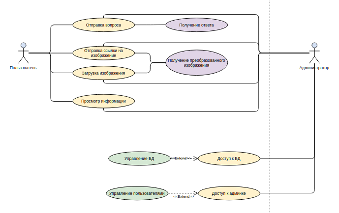
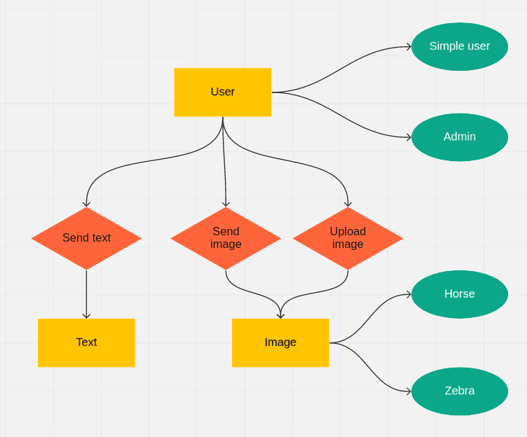
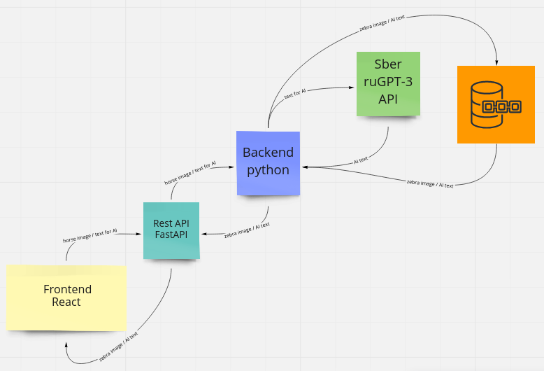

<p align="center">
  
</p>

### Министерство науки и высшего образования Российской Федерации

### Федеральное государственное бюджетное образовательное учреждение высшего образования

### «Московский государственный технический университет имени Н.Э. Баумана

### (национальный исследовательский университет)» (МГТУ им. Н.Э. Баумана)

ФАКУЛЬТЕТ Информатика и системы управления \
КАФЕДРА Программное обеспечение ЭВМ и информационные технологии \
ДИСЦИПЛИНА Основы WEB разработки

### ОТЧЁТ ПО ЛАБОРАТОРНОЙ РАБОТЕ № 3

### "Разработка архитектуры web приложения и прототипирование"

Выполнил:
студент группы ИУ7-68Б(В) \
Косаревский Д.П. \
Преподаватель: Бекасов Д. Е. \
Москва, 2021 г.

#### Задача: 
В данной лабораторной работе необходимо спроектировать архитектуру web-приложения и спланировать процесс разработки.

Замечание: приложение должно включать frontend и backend (с некоторым хранилищем данных — БД, сервис данных, другой источник). Запрещается в качестве frontend использовать vk или tg ботов.

Замечание 2: Эта лабораторная работа посвящена разработке архитектуры, а не самого приложения (!). Без нее дальнейшее продвижение не имеет смысла.

Для сдачи лабораторной работы необходимо предоставить полностью оформленный проект в GitLab/Github c README.md файлом в корне репозитория. README может включать изображения, по-возможности векторные (либо растр с хорошим сжатием без потерь: png).

В README.md должно быть отражено: 
1. Название проекта
   ```
   Artificial Idiot
   ```
   
2. Краткое описание проблемной области и актуальности
   1. Какая проблема
   ```
   Искусственный интелект, существует ли он?
   ```
   1. Источник проблемы
   ```
   Переоценка возможностей ИИ. Непонимание сфер применения.
   ```
   1. Какой подход выбран для решения
   ```
   Знакомство с ИИ при помощи онлайн сервиса, на котором пользователь может не только почерпнуть знания, 
   посмотреть на результат работы нейронных сетей в реальном времени, но и пообщаться с ИИ в чате. 
   (а может быть и в голосовом чате, если разработчики успеют реализовать весь задуманный функционал) 
   ```
   
3. Описание ролей пользователя
   1. Use-Case диаграмма (основные кейсы)
      
      
   1. Назначение ролей пользователя
      ```
      * Пользователь — посещение сайта и использование его основных функций
      * Администратор — пользовательский функционал 
                        + администрирование через панель администратора 
                        + доступ к БД
      ```
4. Сущности предметной области
   1. ER-диаграмма сущностей
      
      
5. Прототип интерфейса (sketch) со всеми страницами. (ссылка на Figma). Краткое описание основных функциональных действий.
   
    * Прототип интерфейса доступен по [ссылке](https://www.figma.com/file/lHOTFha35V9SogjrigYn76/Artificial-idiot)
    * Moodboard в pinterest по [ссылке](https://www.pinterest.co.uk/chikibambonik/artificial-idiot/)


6. Архитектура приложения
   1. Выбор архитектуры (MPA-SPA)
      ```
      Для реализации проекта выбрана SPA-архитектура.
      На бекенде MC (Бизнес логика в виде модели и REST API в виде контроллера) 
      + отдельное фронтенд-приложение.
      ```
   1. Диаграмма взаимодействия Backend-Frontend
      
      
      
   1. Описание протокола взаимодействия Backend-Frontend / Rest API - при наличии 
      ```
      Frontend и Backend взаимодейтсвуют между собой по протоколу HTTP
      Rest API построено на базе FastAPI со встроенным веб-сервером uvicorn
      ```
   1. Структура модулей/классов для Backend и Frontend
      ```
      Структура модулей Backend:
      ├── app
      │   ├── alembic
      │   │   ├── versions
      │   │   ├── README
      │   │   ├── __init__.py
      │   │   ├── env.py
      │   │   └── script.py.mako
      │   ├── api
      │   │   ├── api_v1
      │   │   │   ├── routers
      │   │   │   │   ├── tests
      │   │   │   │   ├── __init__.py
      │   │   │   │   ├── resnet.py
      │   │   │   │   ├── savedb.py
      │   │   │   │   ├── zebrate.py
      │   │   │   │   ├── ruGPT-3.py
      │   │   │   │   ├── auth.py
      │   │   │   │   └── users.py
      │   │   │   └── __init__.py
      │   │   ├── dependencies
      │   │   │   └── __init__.py
      │   │   └── __init__.py
      │   ├── core
      │   │   ├── __init__.py
      │   │   ├── resnet.py
      │   │   ├── savedb.py
      │   │   ├── zebrate.py
      │   │   ├── ruGPT-3.py
      │   │   ├── auth.py
      │   │   ├── config.py
      │   │   └── security.py
      │   ├── db
      │   │   ├── __init__.py
      │   │   ├── crud.py
      │   │   ├── models.py
      │   │   ├── schemas.py
      │   │   └── session.py
      │   ├── tests
      │   │   ├── __init__.py
      │   │   └── test_main.py
      │   ├── __init__.py
      │   ├── alembic.ini
      │   ├── initial_data.py
      │   └── main.py
      ├── alembic.ini
      ├── Dockerfile
      ├── conftest.py
      ├── requirements.txt
      └── pyproject.toml
      
      Структура модулей Frontend:
      ├── public
      │   ├── favicon.ico
      │   ├── index.html
      │   ├── logo.png
      │   ├── manifest.json
      │   └── robots.txt
      ├── src
      │   ├── __tests__
      │   │   ├── home.test.tsx
      │   │   └── login.test.tsx
      │   ├── admin
      │   │   ├── Users
      │   │   │   ├── UserCreate.tsx
      │   │   │   ├── UserEdit.tsx
      │   │   │   ├── UserList.tsx
      │   │   │   └── index.ts
      │   │   ├── Admin.tsx
      │   │   ├── authProvider.ts
      │   │   └── index.ts
      │   ├── config
      │   │   └── index.tsx
      │   ├── utils
      │   │   ├── api.ts
      │   │   ├── auth.ts
      │   │   └── index.ts
      │   ├── views
      │   │   ├── Home.tsx
      │   │   ├── Login.tsx
      │   │   ├── PrivateRoute.tsx
      │   │   ├── Protected.tsx
      │   │   ├── SignUp.tsx
      │   │   └── index.ts
      │   ├── config
      │   │   └── index.js
      │   ├── utils
      │   │   └── index.js
      │   ├── routers
      │   │   └── keys.js
      │   ├── actions
      │   │   ├── loginActions.js
      │   │   ├── zebrateActions.js
      │   │   └── ruGPT3Actions.js
      │   ├── reducers
      │   │   ├── loginReducer.js
      │   │   ├── zebrateReducer.js
      │   │   ├── ruGPT3Reducer.js
      │   │   └── index.js
      │   ├── sagas
      │   │   ├── loginSaga.js
      │   │   ├── zebrateSaga.js
      │   │   ├── ruGPT3Saga.js
      │   │   └── index.js
      │   ├── selectors
      │   │   ├── loginSelectors.js
      │   │   ├── zebrateSelectors.js
      │   │   └── ruGPT3Selectors.js
      │   ├── store
      │   │   ├── actionTypes.js
      │   │   ├── configureStore.js
      │   │   ├── initialState.js
      │   │   └── injectReducer.js
      │   ├── components
      │   │   ├── Header
      │   │   │   ├── styles
      │   │   │   │   └── index.css
      │   │   │   └── index.js
      │   │   ├── Zebrate
      │   │   │   ├── styles
      │   │   │   │   └── index.css
      │   │   │   └── index.js
      │   │   ├── ruGPT3
      │   │   │   ├── styles
      │   │   │   │   └── index.css
      │   │   │   └── index.js
      │   │   ├── Admin
      │   │   │   ├── styles
      │   │   │   │   └── index.css
      │   │   │   └── index.js
      │   ├── App.tsx
      │   ├── Routes.tsx
      │   ├── decs.d.ts
      │   ├── index.css
      │   ├── index.tsx
      │   ├── logo.svg
      │   └── react-app-env.d.ts
      ├── .dockerignore
      ├── .eslintrc.js
      ├── .prettierrc.js
      ├── Dockerfile
      ├── README.md
      ├── package.json
      ├── run.sh
      └── tsconfig.json
      ```
7. Технические детали реализации
   1. Выбор Backend- и Frontend-стеков
      ```
      Backend - FastAPI (Python 3.8)
         * JWT authentication using OAuth2 "password flow" and PyJWT
      Frontend - React (with Typescript)
         * react-router v5 to handle routing
         * Utility functions and higher-order components for handling authentication
      DB - PostgreSQL
      ORM - SqlAlchemy
      DB migrations - Alembic
      Tests - Pytest
      Reverse proxy - Nginx
      Admin dashboard - react-admin
         * Using the same token based authentication as FastAPI backend (JWT)
      ```
   1. Команда: состав, четкое распределение ролей. 
      ```
      Состав команды: kosarevsky - fullstack developer
      
      Проектирование архитектуры приложения - kosarevsky
      Разработка прототипа интерфейса - kosarevsky
      Создание DB - kosarevsky
      Разработка Backend - kosarevsky
      Разработка Frontend - kosarevsky
      Написание тестов - kosarevsky
      Настройка прокси и балансировки - kosarevsky
      Разработка админки - kosarevsky
      ```
8. Структура и подход к CI/CD для проекта (дополнительное задание). 
      ```
      Docker Compose for development
      CI/CD with Github actions
      ```

Весь процесс разработки [распланирован](https://git.iu7.bmstu.ru/iu7-second-degree/web-labs-2021/web-labs-2021-kosarevsky-dmitry/-/boards) с помощью issues Gitlab. 
Все Issues назначены на конкретных участников команды. 
